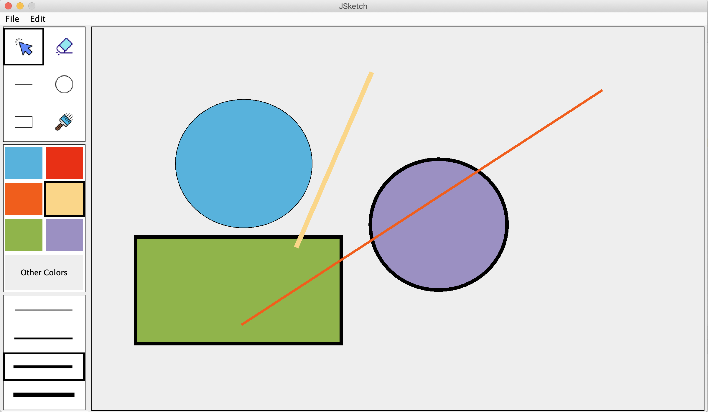

# JSketchDemo

A small desktop drawing app writen in Java. A school project of CS349 University of Waterloo Summer 2019

The repository only shows the demo UI. The source code is set private to prevent plagiarism, please contact me if you want to see the code. :)

### /******************** Synopsis ********************/

A drawing application using Java Swing that can allow a user to select drawing properties, and draw shapes on-screen.

### /******************** Usage for Menubar ********************/

##### File 
  | 
  ----- New: Create a new drawing. Will create a blank new canvas and overwrite the drawing before. (key accelerator: ctrl + N) 
  | 
  ----- Load: Load a drawing from a jsk file. (key accelerator: ctrl + L) 
  | 
  ----- Save: Save the current drawing into a jsk file. (will pop up warning if saving same file name to a director) (key accelerator: ctrl + L) 
   
  
##### Edit 
  | 
  ----- Copy: Copy the current drawing in canvas as a png file into system clipboard. 
   

### /******************** Usage for ToolPalette ********************/

##### Select:
  | 
  ----- Allows the user to select a shape that has been drawn (will have shadow to indicate which which shape is selected). 
  | 
  ----- The selected shape will bring to the front. To select a shape, the user should click this tool, then click on an existing shape. Pressing ESC on the keyboard will clear shape selection. Selecting a shape will cause the "other colors" in the color palette to update and reflect the shape's color and line thickness palette to update and reflect the line thickness of that shape 
  | 
  ----- Selected shape can be drageed with the mouse.  
  | 
  ----- Changing color or line thickness when a shape is selected will update the shape colour and thickness to the new values. 
  |  
  ----- Click on this tool and then click on a shape to delete it. 
   
  
##### Line drawing:
  | 
  ----- Select this to draw a line using the selected color and line thickness. 
   

##### Circle drawing:
  | 
  ----- Select this to draw a circle at the point indicated using the selected line thickness and color. (black for stroke and selected color for filling) 
   

##### Rectangle drawing:
  | 
  ----- Select this to draw a rectangle using the selected line thickness and shape color. (black for stroke and selected color for filling) 
   

##### Fill:
  | 
  ----- Select this tool, and click on a shape to change that shape to the currently selected color. 
   

 ### /******************** Usage for ColorPalette ********************/

A graphical display of six colors and one other color chooser, which the user can use to select the current color. 

##### Left-click on color buttons
  | 
  ----- The current drawing color will be used for any new shapes that are drawn.  
  | 
  ----- If a shape is already selected when a color is chosen, the shape will change to that new color.  
   

##### Right-click on color buttons
  | 
  ----- Pop up a color chooser dialogue that user can select a color, and the color button will change to that color. 
   

### /******************** Usage for LinePalette ********************/

A graphical display of four line widths that the user can select. 

##### Left-click on line buttons
  | 
  ----- Selecting a line width will set the border thickness for any new shapes drawn.  
  | 
  ----- Selecting a shape will change the border thickness to reflect the line thickness of that shape. 
 

### /******************** Additional Features ********************/

##### Customizable color palette (5 marks)
  | 
  ----- User ustomize color buttons in the palette by right-click a button and choose a new color for that button from a color-chooser dialog 
   

##### System-level copy/paste (10 marks)
  | 
  ----- User can paste the entire canvas an an image (using .png supported format) to an outside program (e.g. MS Paint, Photoshop, Pixelmator) 
  | 
  ----- User can paste the canvas by clicking "Edit-Copy" in the Menubar, or using "Ctrl+C" (key accelerator) on the keyboard. 

### /******************** Code Reference ********************/

stated in the code when referred.

### /******************** Resources Reference ********************/

- selectButtonIcon.png

Icons made by <a href="https://www.freepik.com/" title="Freepik">Freepik</a> from <a href="https://www.flaticon.com/" 			    title="Flaticon">www.flaticon.com</a> is licensed by <a href="http://creativecommons.org/licenses/by/3.0/" 			    title="Creative Commons BY 3.0" target="_blank">CC 3.0 BY</a>

 

- eraseButtonIcon.png

Icons made by <a href="https://www.freepik.com/" title="Freepik">Freepik</a> from <a href="https://www.flaticon.com/" 			    title="Flaticon">www.flaticon.com</a> is licensed by <a href="http://creativecommons.org/licenses/by/3.0/" 			    title="Creative Commons BY 3.0" target="_blank">CC 3.0 BY</a>

 

- lineDrawButtonIcon.png

Icons made by <a href="https://www.flaticon.com/authors/smashicons" title="Smashicons">Smashicons</a> from <a href="https://www.flaticon.com/" 			    title="Flaticon">www.flaticon.com</a> is licensed by <a href="http://creativecommons.org/licenses/by/3.0/" 			    title="Creative Commons BY 3.0" target="_blank">CC 3.0 BY</a>

 

- circleDrawButtonIcon.png

Icons made by <a href="https://www.flaticon.com/authors/smashicons" title="Smashicons">Smashicons</a> from <a href="https://www.flaticon.com/" 			    title="Flaticon">www.flaticon.com</a> is licensed by <a href="http://creativecommons.org/licenses/by/3.0/" 			    title="Creative Commons BY 3.0" target="_blank">CC 3.0 BY</a>

 

- rectangleDrawButtonIcon.png

Icons made by <a href="https://www.flaticon.com/authors/dario-ferrando" title="Dario Ferrando">Dario Ferrando</a> from <a href="https://www.flaticon.com/" 			    title="Flaticon">www.flaticon.com</a> is licensed by <a href="http://creativecommons.org/licenses/by/3.0/" 			    title="Creative Commons BY 3.0" target="_blank">CC 3.0 BY</a>

 

- fillButtonIcon.png

Icons made by <a href="https://www.freepik.com/" title="Freepik">Freepik</a> from <a href="https://www.flaticon.com/" 			    title="Flaticon">www.flaticon.com</a> is licensed by <a href="http://creativecommons.org/licenses/by/3.0/" 			    title="Creative Commons BY 3.0" target="_blank">CC 3.0 BY</a>

### /******************** Demo UI ********************/

